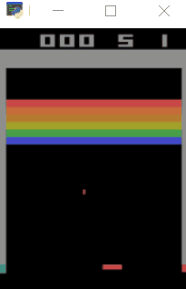

# Deep Reinforcement Learning

This repository includes a general frame for different deep reinforcement learning algorithm for atari games. We implemented and verified Deep Q-Learning and Soft Actor-Critics for discrete action space, and results demos are as follows.



## Hyperparameters

Unless otherwise specified, we use parameters as follows.

- **Parameters for reinforcement learning and atari environment.**

|                    Parameters                     |  Value  |
| :-----------------------------------------------: | :-----: |
|               agent history length                |    4    |
|                    batch size                     |   32    |
|      frame number for an action as one step       |    4    |
|                       gamma                       |  0.99   |
|     target network upgrade frequency (learn)      |  1000   |
|              learn frequency (step)               |    4    |
|                  initial epsilon                  |    1    |
|                   final epsilon                   |  0.05   |
|                 reward clip range                 | [-1, 1] |
|                 memory space size                 | 100000  |
| the frame of  'do nothing' at start of an episode |   28    |

- **We choose Adam as optimization algorithm: torch.optim.Adam**

  | Parameters | Value  |
  | :--------: | :----: |
  |     lr     | 0.0001 |
  |    eps     |  1e-6  |

  The loss function is Huber loss.

- We use a network architecture similar to **[Human-level control through deep reinforcement learning](https://www.nature.com/articles/nature14236)**.

  | Layer | Input size              | Filter      | Stride | Activation |
  | ----- | ----------------------- | ----------- | ------ | ---------- |
  | conv1 | $4\times 84 \times 84$  | $8\times 8$ | 4      | ReLU       |
  | conv2 | $32\times 20 \times 20$ | $4\times 4$ | 2      | ReLU       |
  | conv3 | $64\times 9 \times 9$   | $3\times 3$ | 1      | ReLU       |
  | fc4   | $64\times 7 \times 7$   |             |        | ReLU       |
  | fc5   | $512$                   |             |        |            |

## Results

We implemented algorithm on Pong，Mspacman and Breakout. The gym environments are PongNoFrameskip-v4，MspacmanNoFrameskip-v4 and BreakoutNoFrameskip-v4, respectively. There are many [differences](https://github.com/openai/gym/issues/1280) between PongNoFrameskip-v4 and Pong-v0. We run the program using NVIDIA GeForce GTX 1060. In each graph, the line represents the scores of the last 100/200 episodes and the dot represents every score.

### Pong

In this game, we set the epsilon decay after each step to be 5e-6, and the epsilon will be 0.01 after 1 million frames. Using the Deep Q-Learning algorithm, it takes **~8 hours** to get the highest score (21 points). We treat the above parameters as standard mode, comparing with different parameters.

We compared standard with two other modes. The red line used two hidden layers that the additional layer has 512 neurons linear layer with ReLU activation. For yellow line and dots, agent used the policy at the beginning of a episode, which means the frames dose noting equal zero.


We varied the target network upgrade frequency, the standard mode upgraded target network after 1000 times learn and the other modes were represented as labels.

### Breakout

For breakout, the epsilon would be 0.01 after 5 million frames, and we added a '-1' penalty if the agent lost one 'live'.  After 10,000 episodes, around 35 million frames, the agent could get **409** scores in evaluation mode.  We compare the standard parameters with 10,000 target replace frequency, the latter is slower to learn.


### Mspacman

In this game, epsilon decayed to 0.01 after 5 million frames, and the agent was given a ''-1' reward when it lost a live. We trained the agent on 15,000 episodes, nearly 50 million frames, with a final evaluation mode award of **2680**. For discrete soft actor-critics algorithm, we set the target network upgrade parameter $\tau = 0.05$, and trained the agent around 5 million frames. The latter result is not good, and the reason may be that the agent does not begin with a higher level of exploration, which makes it learns very slowly. However, during the training, the agent could upgrade exploration level by itself, and it could present better with more mature parameters.


## Dependences

- gym == 0.18.0
- atari-py == 0.2.6
- numpy == 1.19.5
- torch == 1.8.1+cu111
- opencv-python == 4.5.1.48
- matplotlib == 3.3.3
## Usage

- You can run through main.py.

```shell
$ python main.py -h
usage: main.py [-h] [--agent {dql,dsac}] [--live_penalty LIVE_PENALTY] [--reward_clip REWARD_CLIP] [--min_epsilon MIN_EPSILON] [--start_epsilon START_EPSILON] [--memory_size MEMORY_SIZE] [--env_name ENV_NAME] [--game_index {0,1,2}]
               [--eval EVAL] [--start_episode START_EPISODE]

optional arguments:
  -h, --help            show this help message and exit
  --agent {dql,dsac}    Deep Q-learning and discrete soft Actor-Critics algorithms.
  --live_penalty LIVE_PENALTY
                        Penalties when agent lose a life in the game.
  --reward_clip REWARD_CLIP
                        Clip reward in [-1, 1] range if True.
  --min_epsilon MIN_EPSILON
                        The probability for random actions.
  --start_epsilon START_EPSILON
                        The probability for random actions.
  --memory_size MEMORY_SIZE
                        The size of the memory space.
  --env_name ENV_NAME   The name of the gym atari environment.
  --game_index {0,1,2}  Represent Breakout, MsPacman and Pong respectively.
  --eval EVAL           True means evaluate model only.
```

- If you want to train deep q-learning algorithm for breakout game. You can also try this in other games with the 'env_name' parameter, but the gym environment should choose 'NoFrameskip-v4' mode.

  ```shell
  $ python main.py --agent=dql --game_index=0
  ```

- For evaluation mode, once trained the agent, changed the final agent name to be  'BreakoutNoFrameskip-v4' for example. We have upload trained agents about above three games.

  ```shell
  $ python main.py --eval=True
  ```

All of the networks, optimizers and scores will be saved in an additional file.

## Reference

- Human-Level Control Through Deep Reinforcement Learning. Nature, 518(7540):529–533, 02 2015. [Link](http://dx.doi.org/10.1038/nature14236)

- Soft Actor-Critic For Discrete Action Settings, Christodoulou, 2019. [Link](https://arxiv.org/abs/1910.07207)
